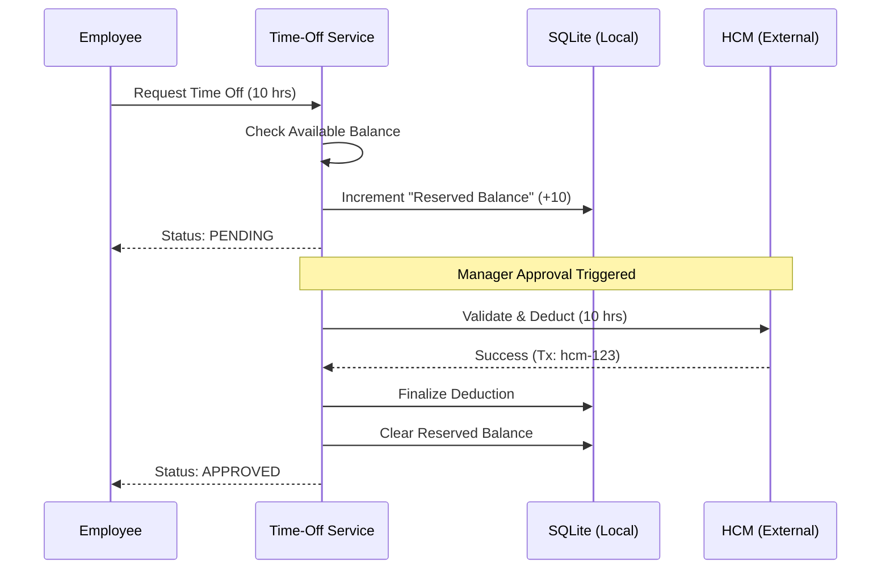

# 🗓️ ReadyOn Time-Off Microservice

### **High-Consistency Leave Orchestration for Enterprise HCM Systems**

 


---

## 📖 Table of Contents
- [1. Project Overview](#1-project-overview)
- [2. Architecture & Design Patterns](#2-architecture--design-patterns)
- [3. Key Features](#3-key-features)
- [4. Tech Stack](#4-tech-stack)
- [5. API Documentation](#5-api-documentation)
- [6. Postman Testing Guide](#6-postman-testing-guide)
- [7. Database Schema](#7-database-schema)
- [8. HCM Integration Strategy](#8-hcm-integration-strategy)
- [9. Installation & Setup](#9-installation--setup)
- [10. Testing & Coverage](#10-testing--coverage)
- [11. Analysis of Alternatives](#11-analysis-of-alternatives)

---

## 🚀 1. Project Overview
The **ReadyOn Time-Off Microservice** is a production-grade backend system designed to bridge the gap between user-facing leave requests and external **Human Capital Management (HCM)** systems (e.g., Workday, SAP). 

In enterprise environments, the HCM is the **Source of Truth (SoT)**. This microservice implements a **distributed consistency strategy** to ensure that employee balances are never over-committed, even when the external HCM is slow or temporarily unavailable.

---

## 🏗️ 2. Architecture & Design Patterns

The system utilizes a **Modular Monolith** architecture with several sophisticated patterns to guarantee data integrity:

### **The Reserved Balance Pattern**
To prevent "double spending" during the approval window, we use a two-stage deduction process:



### **Core Resiliency**
- **Optimistic Locking**: Prevents race conditions during simultaneous request updates using `@VersionColumn`.
- **Atomic Mutexes**: Serializes balance reservations to circumvent SQLite's concurrent transaction limitations.
- **Circuit Breaker (Opossum)**: Protects the system from cascading failures during HCM downtime.

---

## ✨ 3. Key Features
- ✅ **State Machine Request Lifecycle**: `SUBMITTED` → `PENDING` → `APPROVED` / `REJECTED`.
- ✅ **Real-time HCM Validation**: Approval is blocked if the HCM balance has changed out-of-band.
- ✅ **Batch Reconciliation**: Overwrites local drift with full HCM corpus snapshots.
- ✅ **Global Idempotency**: `X-Idempotency-Key` prevents duplicate deductions on retries.
- ✅ **Immutable Audit Logs**: Comprehensive history of every balance mutation.
- ✅ **Per-Location Tracking**: Supports complex enterprise structures where balances vary by location.

---

## 🛠️ 4. Tech Stack
- **Framework**: [NestJS](https://nestjs.com/) (Node.js 18+)
- **ORM**: [TypeORM](https://typeorm.io/)
- **Database**: **SQLite** (Wired with WAL mode for peak performance)
- **Circuit Breaker**: [Opossum](https://github.com/nodeshift/opossum)
- **Testing**: [Jest](https://jestjs.io/) & [Supertest](https://github.com/visionmedia/supertest)

---

## 📡 5. API Documentation

### **Time-Off Lifecycle Endpoints**
| Method | Endpoint | Description |
| :--- | :--- | :--- |
| `GET` | `/time-off/balance` | Fetch current & reserved balances. |
| `POST` | `/time-off/request` | Submit new request (Triggers Reservation). |
| `POST` | `/time-off/approve/:id` | Execute multi-stage HCM synchronization. |
| `POST` | `/time-off/reject/:id` | Terminate request and release hold. |
| `POST` | `/time-off/sync` | Trigger full reconciliation with HCM. |

---

## 📮 6. Postman Testing Guide

Follow this sequence to test the full lifecycle:

### **1. Check Balance**
`GET http://localhost:3000/time-off/balance?employeeId=123e4567-e89b-12d3-a456-426614174000`

### **2. Submit Request (Create Hold)**
`POST http://localhost:3000/time-off/request`
**Headers**: `x-idempotency-key: unique-key-123`
**Body**:
```json
{
  "employeeId": "123e4567-e89b-12d3-a456-426614174000",
  "locationId": "NY",
  "requestedHours": 16,
  "startDate": "2026-06-01",
  "endDate": "2026-06-02",
  "managerComment": "Summer Trip"
}
```

### **3. Approve Request (Sync with HCM)**
`POST http://localhost:3000/time-off/approve/{ID_FROM_STEP_2}`
**Body**:
```json
{
  "managerComment": "Approved by HR"
}
```

---

## 💾 7. Database Schema
- **Employee**: User identification and metadata.
- **TimeOffBalance**: Per-employee, per-location tracking. Includes `balance` vs `reservedBalance`.
- **TimeOffRequest**: Status tracking linked to HCM transaction IDs.
- **AuditLog**: Immutable record of all state changes.
- **IdempotencyKey**: Ensures "at-most-once" execution.

---

## 🔗 8. HCM Integration Strategy
The service implements **"Defensive Integration"**:
1. **Pre-flight Check**: Validates balance in HCM *before* starting the local transaction.
2. **Atomic Sync**: Only clears local reserved balances *after* HCM confirms deduction.
3. **Emergency Rollback**: If HCM fails during deduction, the local `reservedBalance` is automatically released.
4. **Drift Compensation**: Batch syncs correct anniversary bonuses or out-of-system changes.

---

## ⚙️ 9. Installation & Setup

```bash
# 1. Clone & Install
git clone https://github.com/Abdullahkhan80/readyon-time-off-service.git
cd readyon-time-off-service
npm install

# 2. Build & Initialize DB
npm run build

# 3. Start Development Mode
npm run start:dev
```

---

## 🧪 10. Testing & Coverage
We maintain a strict **90%+ coverage** for the core business logic.

```bash
# Run Unit Tests
npm run test

# Run E2E Integration Tests (includes Mock HCM)
npm run test:e2e

# Generate Coverage Report
npm run test:cov
```

---

## ⚖️ 11. Analysis of Alternatives

| Approach | Considerations | Decision |
| :--- | :--- | :--- |
| **Immediate Deduction** | Difficult to rollback; poor UX if sync fails. | ❌ Rejected |
| **Reserved Balance** | Ensures integrity; allows clear "Pending" state. | ✅ Chosen |
| **Optimistic Locking** | Scalable; avoids heavy DB row-level locks. | ✅ Chosen |
| **Batch Reconcile** | Essential for out-of-band HCM updates. | ✅ Chosen |

---
Built with ❤️ for High-Consistency HR Systems.
